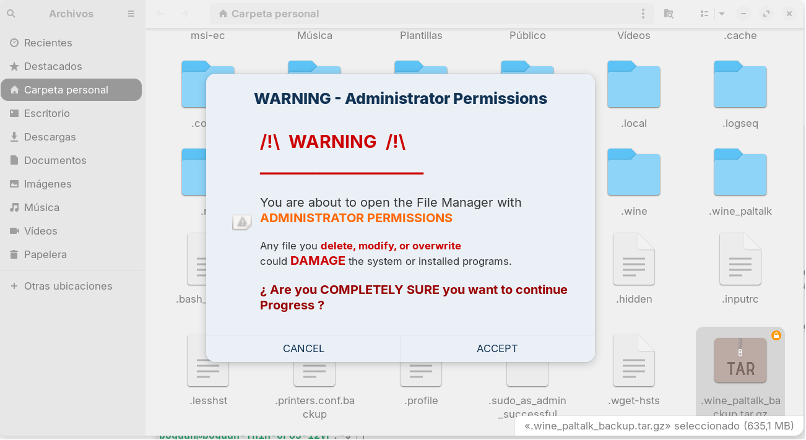

# 🛡️ Nautilus Right-Click Admin (3-Way)

> Security warning dialog when opening Nautilus (file manager) as administrator on Linux.



## 📋 Description

**Nautilus Right-Click Admin (3-Way)** adds a visual warning dialog (colors, icons, and bold text) before opening the File Manager with administrator permissions.

### ✨ Features

- 🎨 **Attractive visual window** with warning colors and icons
- ⚠️ **Clear message** about the risks of modifying system files
- 🔒 **ACCEPT / CANCEL buttons** to confirm the action
- 📁 **Works anywhere**: folders, files, and empty space
- 🖱️ **Full integration** in the Nautilus context menu (right-click)
- 🚫 **No terminal needed**: everything from the file manager

## 🚀 Quick Installation

### Method 1: Automatic script (recommended)

```bash
git clone https://github.com/bogdansaniuta/Nautilus-rightclick-admin-3way.git
cd Nautilus-rightclick-admin-3way
sudo ./install.sh
```

### Method 2: Manual installation

```bash
# 1. Clone repository
git clone https://github.com/bogdansaniuta/Nautilus-rightclick-admin-3way.git
cd Nautilus-rightclick-admin-3way

# 2. Copy files
sudo cp nautilus-admin-warning.sh /usr/local/bin/
sudo chmod +x /usr/local/bin/nautilus-admin-warning.sh
sudo cp nautilus-admin-custom.py /usr/share/nautilus-python/extensions/

# 3. Restart Nautilus
nautilus -q
```

## 📖 How to Use

1. Open the **File Manager** (Nautilus)
2. **Right-click** on any folder, file, or empty space
3. Select: **"Open as Administrator (with warning)"**
4. Read the warning and press **ACCEPT** or **CANCEL**

## 🖥️ Compatibility

| Distribution | Status |
|-------------|--------|
| Zorin OS | ✅ Tested |
| Ubuntu | ✅ Compatible |
| Linux Mint | ✅ Compatible |
| Debian | ✅ Compatible |
| Pop!_OS | ✅ Compatible |
| Fedora | ⚠️ Requires adaptation |

**Requirements:**
- Nautilus (GNOME Files)
- `zenity`
- `python3-nautilus`

## 🗑️ Uninstallation

```bash
sudo ./uninstall.sh
```

## 🎨 Customization

You can modify colors, text, and size by editing:
```bash
sudo nano /usr/local/bin/nautilus-admin-warning.sh
```

### Available Colors

| Code | Color |
|------|-------|
| `#CC0000` | Intense red |
| `#FF6600` | Orange |
| `#990000` | Dark red |
| `#333333` | Dark gray |

## 🤝 Contributing

1. Fork the repository
2. Create a branch (`git checkout -b feature/new-function`)
3. Commit your changes (`git commit -am 'Add new function'`)
4. Push to the branch (`git push origin feature/new-function`)
5. Open a Pull Request

## 📄 License

MIT License - Free to use, modify, and distribute.

## 🙏 Credits

- **Author:** Bogdan
- **System:** Zorin OS
- **Inspiration:** Windows "Run as administrator" function

---

⚠️ **WARNING:** Use this tool with caution. Modifying system files can damage your Linux installation.
